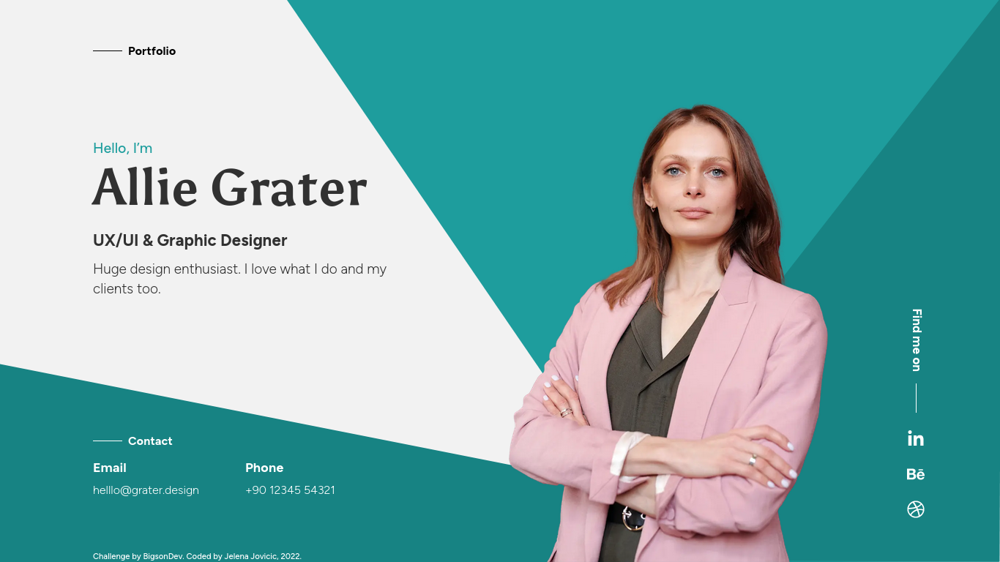

    
    

        
        
    

    <h1>
        Hello, World!
        
    </h1>

### :woman_technologist: About Me :

I am a front-end developer enjoying learning new technologies and following best practices in building accessible, responsive and interactive websites 😄. 

- 💼 Open to a junior role or a freelance gig.

- :book: Learning React.

- 🚀 Next goal: Finish [freeCodeCamp](https://www.freecodecamp.org/) Front End Development Libraries Certification!

---

### :hammer_and_wrench: Languages and Tools :

  &nbsp;
  &nbsp;
  &nbsp;
  &nbsp;
  &nbsp;
  &nbsp;
  

--- 

### ⭐ Milestones :

- 🆕 Finished [devChallenges](https://devchallenges.io/) Responsive Web Developer Path. [See Certificate](https://devchallenges.io/certificates/GuC8XEGdmgKKTSHPfuoQ)!

- Got [freeCodeCamp](https://www.freecodecamp.org/) JavaScript Algorithms and Data Structures Certification! [See Certification](https://www.freecodecamp.org/certification/je-jo/javascript-algorithms-and-data-structures)!

- Made an actual web app that is used by my team in the real world. :) It's an [early cancellation fee calculator](https://github.com/je-jo/early-cancellation-fee-calculator). Please check it out.

- Finished [The Odin Project](https://www.theodinproject.com/) Foundations Path!

- Got [freeCodeCamp](https://www.freecodecamp.org/) Responsive Web Design Certification. [See Certification](https://www.freecodecamp.org/certification/je-jo/responsive-web-design)!

--- 

### ⏲️ Latest Project :

  

A conversion of an Adobe XD design to HTML, built with Sass, with a Lighthouse score of 100.

- [Repo](https://github.com/je-jo/business-card-project)
- [Live](https://je-jo.github.io/business-card-project/)

---

### 👌 Credits :

- This README was built following [these instructions](https://www.sitepoint.com/github-profile-readme/). Thank you [itsZed0](https://github.com/itsZed0)!
- Cover Photo by [Alexander Sinn](https://unsplash.com/photos/KgLtFCgfC28?utm_source=unsplash&utm_medium=referral&utm_content=creditShareLink), recolored by me.

---

### :fire: My Stats :

---

