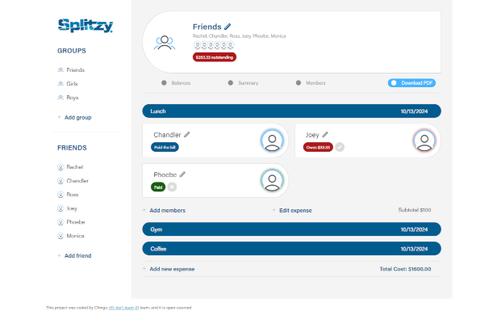

    
    

        
    

    <h1>
        Hello, World!
        
    </h1>

### :woman_technologist: About Me :

I am transitioning into Quality Assurance from a background in customer service and admin support, and I'm also a self-taught front-end developer. Looking forward to apply my skills in a QA or front-end role! 

- 💼 Open to internships or junior roles in QA or front-end.

- :book: Currently following [Turing School](https://turing.edu/) Lesson Plan.

---

### :hammer_and_wrench: Languages and Tools :

  &nbsp;
  &nbsp;
  &nbsp;
  &nbsp;
  &nbsp;
  &nbsp;
  &nbsp;
  &nbsp;
  &nbsp;
  &nbsp;
  
  &nbsp;

---

### ⭐ Milestones :

- Completed [IT Bootcamp](https://itbootcamp.rs/) QA Certification!

- Participated in a [Chingu](https://www.chingu.io/) Voyage! Worked alongside a team of four developers to create [Splitzy](https://chingu-voyages.github.io/v51-tier1-team-01/) - an expense splitter web app.

- Finished [devChallenges](https://devchallenges.io/) Responsive Web Developer Path. [See Certificate](https://devchallenges.io/certificates/GuC8XEGdmgKKTSHPfuoQ)!

- Got [freeCodeCamp](https://www.freecodecamp.org/) JavaScript Algorithms and Data Structures Certification! [See Certification](https://www.freecodecamp.org/certification/je-jo/javascript-algorithms-and-data-structures)!

- Made an actual web app that is used by my team in the real world. :) It's an [early cancellation fee calculator](https://github.com/je-jo/early-cancellation-fee-calculator). Please check it out.

- Finished [The Odin Project](https://www.theodinproject.com/) Foundations Path!

- Got [freeCodeCamp](https://www.freecodecamp.org/) Responsive Web Design Certification. [See Certification](https://www.freecodecamp.org/certification/je-jo/responsive-web-design)!

---

### ⏲️ Latest QA Project :

Final project for [IT Bootcamp](https://itbootcamp.rs/). The project covers manual test cases and bug reports for the [Saucedemo website](https://www.saucedemo.com) and functionality testing in Selenium, using POM and TestNG.

- [Repo](https://github.com/je-jo/qa-itbootcamp-final)

---

### ⏲️ Latest Front-End Project :

  

A [Chingu](https://www.chingu.io/) Tier 1 Team Project. Splitzy enables users to split expenses among participants within an expense group. It includes features like adding, updating, and deleting expenses, and it automatically calculates balances for each participant. The application is built using vanilla frontend technologies and is entirely browser-based, leveraging local storage for data persistence.

- [Repo](https://github.com/chingu-voyages/v51-tier1-team-01)
- [Live](https://chingu-voyages.github.io/v51-tier1-team-01/)

---

### 👌 Credits :

- This README was built following [these instructions](https://www.sitepoint.com/github-profile-readme/). Thank you [itsZed0](https://github.com/itsZed0)!
- Cover Photo by [Alexander Sinn](https://unsplash.com/photos/KgLtFCgfC28?utm_source=unsplash&utm_medium=referral&utm_content=creditShareLink), recolored by me.

---

### :fire: My Stats :

---

